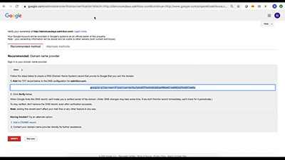

# Visão geral do Painel de controle do Campaign

O Painel de controle do Adobe Campaign permite que os administradores do Campaign monitorem ativos principais e executem tarefas administrativas, como gerenciar o armazenamento SFTP por instância, gerenciar chaves GPG ou subdomínios e certificados.

## Novidades

* **[Monitoramento de bancos de dados](/help/control-panel-tutorials/performance-monitoring/monitoring-databases.md)**

   *Saiba como monitorar o uso do banco de dados de suas instâncias.*

* **[Delegar subdomínios usando CNAME](/help/control-panel-tutorials/subdomains-and-certificates/delegating-subdomains-using-cname.md)**

   *Saiba como configurar e enviar um subdomínio usando CNAMEs no Painel de controle do Campaign.*

Consulte a [Notas de versão](https://experienceleague.adobe.com/docs/control-panel/using/release-notes.html?lang=pt-BR) para obter mais informações sobre as versões mais recentes do produto.

## Escolha de pessoal

<table>
<tr>
  <td>
    
    

      <a href="./subdomains-and-certificates/subdomain-delegation.md">
    <strong>Delegar subdomínios para o Adobe Campaign (vídeo)</strong>
    </a>
    

    

    <em>Saiba como delegar completamente um subdomínio ao Adobe Campaign.</em>
    

  </td>
   <td>
    
    

    <a href="./subdomains-and-certificates/google-txt-record-management.md">
    <strong>Gerenciamento de registros TXT do Google (vídeos)</strong>
    </a>
    

    

    <em> Saiba como adicionar registro de verificação do site Google TXT a todos os seus subdomínios usados para enviar emails para endereços GMAIL por meio do Painel de controle do Campaign.</em>
    

  </td>
  <td>
    
    

      <a href="./sftp-management/connect-to-sftp-server.md">
    <strong>Conectar-se a um servidor SFTP</strong>
    </a>
    

    

    <em>Saiba como se conectar ao servidor SFTP usando um aplicativo SFTP cliente, usando as chaves que você armazenou no Painel de controle do Campaign. </em>
    

  </td>
</tr>
</table>

## Recursos adicionais

* [Centro de ajuda do Painel de controle do Campaign](https://experienceleague.adobe.com/docs/control-panel/using/control-panel-home.html?lang=br)
