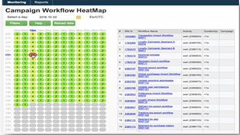
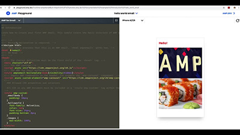

# Tutoriais do Adobe Campaign Classic V7 – Visão geral

O Adobe Campaign fornece uma plataforma para criação de experiências para clientes entre canais, além de um ambiente para a organização visual de campanhas, a gestão de interações em tempo real e a execução entre canais. Este guia do usuário contém vídeos e tutoriais sobre os vários recursos e funcionalidades do Adobe Campaign Classic V7.

>[!INFO]
> Você tem dúvidas? Deseja compartilhar sua experiência ou trocar ideias com colegas? Ou você quer compartilhar seu feedback sobre o conteúdo de aprendizado com a equipe da Adobe? Participe da conversa no [thread da comunidade de aprendizagem do Adobe Campaign](https://experienceleaguecommunities.adobe.com:443/t5/adobe-campaign-classic/join-the-discussion-on-adobe-campaign-learning/td-p/419096).

## Novidades

* **[Painel de controle do Campaign para modelos de hospedagem híbrida](https://experienceleague.adobe.com/docs/control-panel-learn/control-panel/control-panel-for-hybrid-hosting-models.html?lang=pt-BR)**

   *Saiba como ativar o Painel de controle para modelos de hospedagem híbrida do Adobe Campaign, acessar o Painel de controle e desbloquear os principais recursos.*

* **[Painel de controle do Campaign - Monitorar workflows](https://experienceleague.adobe.com/docs/control-panel-learn/control-panel/performance-monitoring/monitor-workflows.html?lang=pt-BR){target=&quot;_blank&quot;}**

   *Saiba como monitorar o uso de armazenamento temporário dos workflows e onde definir as configurações do workflow para evitar problemas no banco de dados ou no workflow na sua instância.*

* **[Painel de controle do Campaign - Monitorar taxas de transferência e latência](https://experienceleague.adobe.com/docs/control-panel-learn/control-panel/performance-monitoring/monitor-throughputs-and-latency.html?lang=pt-BR){target=&quot;_blank&quot;}**

   *Saiba como monitorar as taxas de transferência de entrega e as latências de mensagem transacional da instância do Campaign.*

* **[Introdução ao SMS](https://experienceleague.adobe.com/docs/campaign-learn/set-up-sms-for-adobe-campaign/introduction-to-sms.html?lang=pt-BR)**

   *Saiba como o SMS funciona e como o Adobe Campaign envia SMS*

* **[Configurar uma conta SMS para um provedor SMPP padrão](https://experienceleague.adobe.com/docs/campaign-learn/set-up-sms-for-adobe-campaign/set-up-account-for-standard-smpp-provider.html?lang=pt-BR)**

   *Saiba como adaptar o conector SMS ao seu provedor SMPP. Ajuste as configurações do SMS para lidar com limites de conexão, configurar a taxa de transferência máxima, a janela de envio e a criptografia com TLS.*

## Escolha de pessoal

<table>
<tr>
  <td>
    
    

      <a href="./monitoring-campaign-classic/workflow-heatmap.md">
    <strong>Heatmaps do workflow</strong>
    </a>
    

    

    <em>Obtenha uma visão geral sobre o número de workflows simultâneos.</em>
    

  </td>
   <td>
    
    

      <a href="./monitoring-campaign-classic/audit-trail.md">
    <strong>Trilha de auditoria</strong>
    </a>
    
 
    

    <em>Obtenha uma lista abrangente de ações e eventos que ocorrem no Adobe Campaign.</em>
    

  </td>
  <td>
    
    

      <a href="./sending-messages/email-channel/defining-interactive-email-content-with-amp.md">
    <strong>Definir conteúdo de email interativo com o AMP</strong>
    </a>
    

    

    <em>Saiba como ativar e usar o AMP no Adobe Campaign Classic </em>
    

  </td>
</tr>
</table>

## Recursos adicionais

* [Documentação](https://experienceleague.adobe.com/docs/campaign-classic/using/getting-started/starting-with-adobe-campaign/about-adobe-campaign-classic.html?lang=pt-BR)
