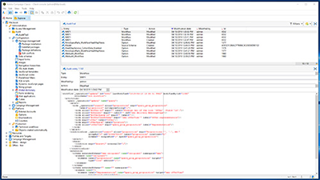

# Tutoriais do Adobe Campaign Classic – Visão geral

O Adobe Campaign fornece uma plataforma para projetar experiências de clientes entre canais, além de um ambiente para a organização visual de campanhas, a gestão de interações em tempo real e a execução entre canais. Este guia do usuário contém vídeos e tutoriais sobre os vários recursos e características do Adobe Campaign Classic.

## Novidades

* **[Introdução às notificações por push para Android](/help/tutorial-getting-started-with-push-notifications-for-android/introduction.md)**

   *Este tutorial o guiará pelas etapas envolvidas no envio de notificações por push do Adobe Campaign para um aplicativo Android.*

* **[Delegar subdomínios usando CNAME (beta)](/help/control-panel-tutorials/subdomains-and-certificates/delegating-subdomains-using-cname.md)**

   *Saiba como configurar e enviar um subdomínio usando CNAMEs no Painel de controle do Campaign.*

* **[Monitoramento de bancos de dados](/help/control-panel-tutorials/performance-monitoring/monitoring-databases.md)**

   *Saiba como monitorar o uso do banco de dados de suas instâncias.*

## Escolha de pessoal

<table>
<tr>
  <td>
    
    

      <a href="./monitoring-campaign-classic/workflow-heatmap.md">
    <strong>Heatmaps do workflow</strong>
    </a>
    

    

    <em>Obtenha uma visão geral sobre o número de workflows simultâneos.</em>
    

  </td>
   <td>
    
    

      <a href="./monitoring-campaign-classic/audit-trail.md">
    <strong>Trilha de auditoria</strong>
    </a>
    
 
    

    <em>Obtenha uma lista abrangente de ações e eventos que ocorrem no Adobe Campaign.</em>
    

  </td>
  <td>
    
    

      <a href="./sending-messages/email-channel/defining-interactive-email-content-with-amp.md">
    <strong>Definir conteúdo de email interativo com o AMP</strong>
    </a>
    

    

    <em>Saiba como ativar e usar o AMP no Adobe Campaign Classic </em>
    

  </td>
</tr>
</table>

## Recursos adicionais

* [Documentação](https://docs.adobe.com/content/help/pt-BR/campaign-classic/using/getting-started/starting-with-adobe-campaign/about-adobe-campaign-classic.html)
